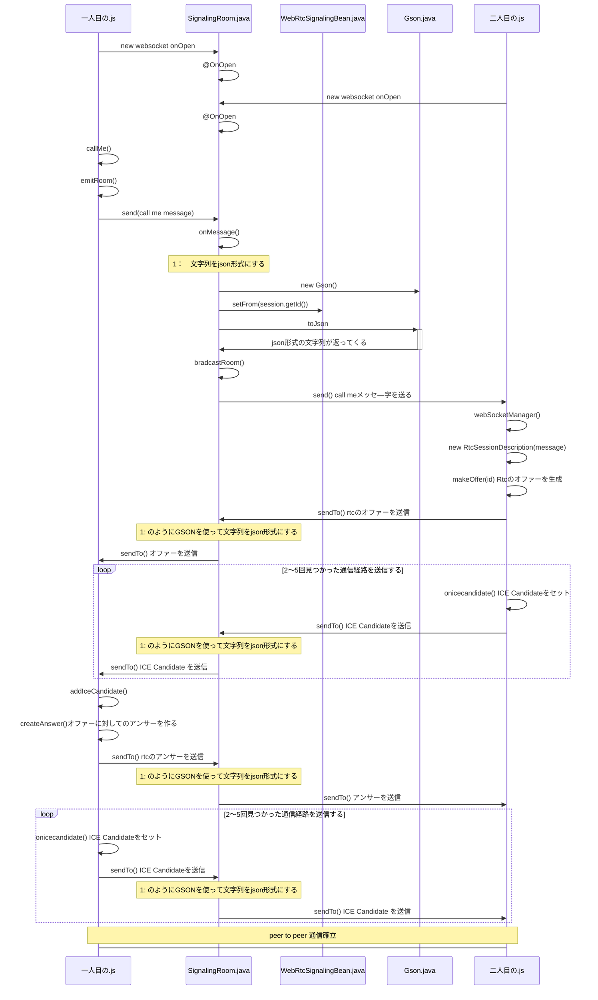

# ビデオチャットシーケンス図

```mermaid
sequenceDiagram
    participant 1j as 一人目の.js
    participant signal as SignalingRoom.java
    participant bean as WebRtcSignalingBean.java
    participant gson as Gson.java
    participant 2j as 二人目の.js
    
    1j ->> signal: new websocket onOpen
    signal ->> signal: @OnOpen
    2j ->> signal : new websocket onOpen
    signal ->> signal: @OnOpen
    1j ->> 1j : callMe()
    1j ->> 1j : emitRoom()
    1j ->> signal : send(call me message)
    signal ->> signal : onMessage()
    Note over signal, signal: 1：　文字列をjson形式にする
    signal ->> gson : new Gson()
    signal ->> bean : setFrom(session.getId())
    signal ->>+ gson : toJson
    gson ->>- signal : json形式の文字列が返ってくる
    signal ->> signal: bradcastRoom()
    signal ->> 2j: send() call meメッセ―字を送る
    2j ->> 2j : webSocketManager()
    2j ->> 2j : new RtcSessionDescription(message)
    2j ->> 2j : makeOffer(id) Rtcのオファーを生成
    2j ->> signal : sendTo() rtcのオファーを送信
    Note over signal, signal: 1: のようにGSONを使って文字列をjson形式にする
    signal ->> 1j : sendTo() オファーを送信
    loop 2～5回見つかった通信経路を送信する
        2j ->> 2j: onicecandidate() ICE Candidateをセット 
        2j ->> signal : sendTo() ICE Candidateを送信
        Note over signal, signal: 1: のようにGSONを使って文字列をjson形式にする
        signal ->> 1j : sendTo() ICE Candidate を送信
    end
    1j ->> 1j : addIceCandidate()
    1j ->> 1j: createAnswer()オファーに対してのアンサーを作る
    1j ->> signal : sendTo() rtcのアンサーを送信
    Note over signal, signal: 1: のようにGSONを使って文字列をjson形式にする
    signal ->> 2j : sendTo() アンサーを送信
    loop 2～5回見つかった通信経路を送信する
        1j ->> 1j: onicecandidate() ICE Candidateをセット 
        1j ->> signal : sendTo() ICE Candidateを送信
        Note over signal, signal: 1: のようにGSONを使って文字列をjson形式にする
        signal ->> 2j : sendTo() ICE Candidate を送信
    end
    Note over 1j, 2j : peer to peer 通信確立
    1j -> 2j: 
```
